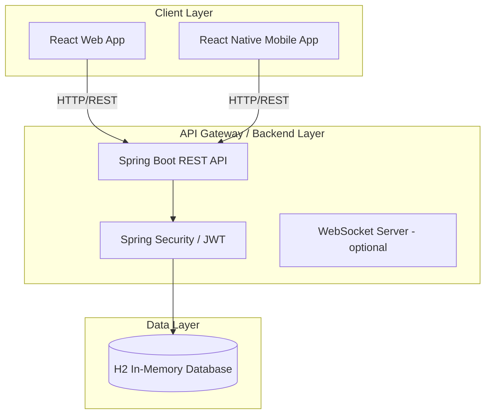

# Localite Architecture Overview

Localite is designed as a modern, multi-platform community engagement ecosystem. The architecture is split into three primary components: a Spring Boot backend, a React web frontend, and a React Native mobile application.

## High-Level Architecture

## Component Breakdown

### 1. Backend (Spring Boot)
- **Framework**: Spring Boot 3.x
- **Language**: Java 17+
- **Security**: Spring Security with JWT (JSON Web Tokens) for stateless authentication.
- **Data Access**: Spring Data JPA using Hibernate.
- **Database**: H2 In-Memory Database (for MVP phase, easily swappable to PostgreSQL/MySQL via `application.properties`).
- **Core Entities**:
  - `User`: Handles authentication, profile data, gamification scores (Trust Score).
  - `Event`: Core entity representing community operations.
  - `Rsvp`: Junction entity mapping Users to Events with status tracking.
  - `Review`: Post-event feedback mapping to hosts.
  - `Follow`: Social graph edges between users.
  - `DirectMessage`: 1-on-1 secure messaging.

### 2. Web Frontend (React)
- **Framework**: Vite + React
- **Styling**: Tailwind CSS (with custom neon-lime / dark mode design system in `index.pcss`).
- **Routing**: React Router DOM.
- **State Management**: React Context API (`AuthContext` for user session).
- **Animations**: GSAP (GreenSock) for high-performance micro-animations.
- **Maps**: Leaflet (`react-leaflet`) for geospatial event discovery.
- **Charts**: Recharts for Host Analytics Dashboard.

### 3. Mobile Frontend (React Native / Expo)
- **Framework**: Expo / React Native
- **Navigation**: React Navigation (Bottom Tabs + Native Stack).
- **Styling**: React Native StyleSheet with custom dark/neon-lime theme.
- **State Management**: AsyncStorage for persistent JWT token storage.
- **Maps**: `react-native-maps` for geospatial viewing.
- **Icons**: `@expo/vector-icons` (Ionicons).
- **Charts**: `react-native-chart-kit` for analytics visualizations.

## Security Architecture
1. **Authentication**: Users log in via `/api/users/login`. The backend validates credentials and issues a JWT signed with a secret key.
2. **Authorization**: All secured endpoints require the JWT in the `Authorization: Bearer <token>` header. The `JwtRequestFilter` intercepts requests, validates the token, and sets the `SecurityContext`.
3. **CORS**: Cross-Origin Resource Sharing is configured globally to allow the Web and Mobile clients to interact with the API on `localhost`.

## Deployment Strategy
While currently optimized for local development (using localhost and in-memory DB), the architecture is container-ready. 
- The **Backend** can be containerized via Docker and deployed to AWS ECS, Heroku, or GCP Cloud Run.
- The **Web App** builds to static files (`npm run build`) deployable to Vercel, Netlify, or AWS S3/CloudFront.
- The **Mobile App** uses Expo Application Services (EAS) for seamless over-the-air updates and building binaries (APK/AAB/IPA) for app stores.
